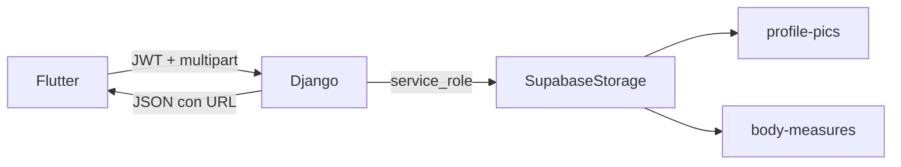

# Migrar fotos de Heft a Supabase Storage

Guía paso a paso. La app Flutter **no** necesita la clave de Supabase: solo el backend sube archivos y devuelve URLs (públicas o firmadas).

---

## 1. Crear proyecto en Supabase

1. Entra en [https://supabase.com](https://supabase.com) e inicia sesión.
2. **New project** → nombre (p. ej. `heft`), contraseña de base de datos, región cercana a tus usuarios.
3. Espera a que el proyecto esté **Active**.

---

## 2. Crear buckets de Storage

En el panel: **Storage** → **New bucket**.

| Bucket           | Nombre sugerido   | Público | Uso                          |
|------------------|-------------------|---------|------------------------------|
| Fotos de perfil  | `profile-pics`    | **Sí**  | Avatar; URL estable pública  |
| Progreso corporal| `body-measures`   | **No**  | Fotos privadas; URL firmada  |

- **profile-pics**: marca *Public bucket*.
- **body-measures**: deja *Private* (solo el backend con `service_role` accede).

No hace falta que la app móvil hable con Storage directamente.

---

## 3. (Opcional) Políticas RLS

Con **service_role** en Django, las políticas RLS se omiten en el servidor. Si más adelante subes desde el cliente con `anon` key, añade políticas por `auth.uid()`.

Para el flujo actual (solo backend), puedes saltarte este paso.

---

## 4. Obtener credenciales

**Project Settings** → **API**:

| Variable                         | Dónde copiarla        |
|----------------------------------|------------------------|
| `SUPABASE_URL`                   | Project URL            |
| `SUPABASE_SERVICE_ROLE_KEY`      | `service_role` (secret)|

**Importante:** la `service_role` solo en el backend (Render, `.env` local). **Nunca** en Flutter ni en repos públicos.

La `anon` key no se usa en esta integración.

---

## 5. Variables de entorno del backend

En `backend/.env` (local) y en **Render** → Environment:

```env
SUPABASE_URL=https://TU_PROYECTO.supabase.co
SUPABASE_SERVICE_ROLE_KEY=eyJhbGciOi...
SUPABASE_PROFILE_BUCKET=profile-pics
SUPABASE_BODY_BUCKET=body-measures
SUPABASE_PROFILE_BUCKET_PUBLIC=True
SUPABASE_SIGNED_URL_TTL=3600
```

Opcional — avatar por defecto en Supabase:

1. Sube `DefaultProfile.png` al bucket público `profile-pics` (carpeta `defaults/`).
2. Copia la URL pública y ponla en:

```env
DEFAULT_PROFILE_PICTURE_URL=https://TU_PROYECTO.supabase.co/storage/v1/object/public/profile-pics/defaults/DefaultProfile.png
```

Sin Supabase configurado, el backend guarda en `backend/media/` (desarrollo local).

---

## 6. Instalar dependencias y migrar Django

```bash
cd backend
pip install -r requirements.txt
python manage.py migrate
```

Reinicia el servidor (`runserver` o despliegue en Render).

---

## 7. Desplegar backend

1. Sube el código con la integración Supabase.
2. Añade las variables del paso 5 en Render.
3. **Redeploy** y comprueba que existan las rutas `/api/body-measures/`.

La app Flutter sigue usando `API_BASE_URL`; no cambies nada por Storage salvo que la API responda con URLs nuevas.

---

## 8. Probar

| Acción              | Resultado esperado                                      |
|---------------------|---------------------------------------------------------|
| Cambiar foto perfil | Objeto en `profile-pics/user_<id>/...` + URL pública    |
| Entrada con foto    | Objeto en `body-measures/user_<id>/...` + URL firmada  |
| Sin foto en entrada | `photo: null`                                           |
| Usuario sin avatar  | `DEFAULT_PROFILE_PICTURE_URL`                           |

En Supabase **Storage** → bucket → deberías ver carpetas `user_<id>/`.

---

## 9. Migrar archivos antiguos de Cloudinary

Las filas que ya guardan una URL `https://res.cloudinary.com/...` en la base de datos **siguen funcionando** (el serializer detecta URLs absolutas).

Para moverlas a Supabase:

1. Descarga cada imagen desde la URL de Cloudinary.
2. Súbela al bucket correcto con la misma estructura: `user_<id>/nombre.jpg`.
3. Actualiza en PostgreSQL el campo `name` del archivo (ruta relativa en el bucket), no la URL completa — o deja que un nuevo upload sustituya la foto.

Script manual recomendado solo si tienes muchos usuarios; para pocos, que vuelvan a subir foto desde la app.

**GIFs de ejercicios** en Cloudinary (`scripts/sync_to_cloudinary.py`) son independientes; no pasan por estos buckets.

---

## 10. Limpiar Cloudinary (cuando ya no lo uses)

1. Quita `CLOUDINARY_*` de Render y `.env`.
2. Opcional: borra assets en el dashboard de Cloudinary.
3. El paquete `cloudinary` en `requirements.txt` solo queda para el script de sincronización de ejercicios; puedes migrar esos GIFs más adelante.

---

## Resumen de arquitectura



- **Perfil:** URL pública permanente.
- **Progreso:** URL firmada (~1 h por defecto); al caducar, la app vuelve a pedir la lista al API.

---

## Problemas frecuentes

| Síntoma | Solución |
|---------|----------|
| Error al subir foto | Revisa `SUPABASE_URL` y `service_role` en el entorno del proceso |
| 404 en fotos de progreso | URL firmada caducada → refrescar datos desde API |
| Sigue guardando en `media/` local | Faltan variables Supabase; reinicia Django tras editar `.env` |
| Bucket not found | Nombres exactos `profile-pics` y `body-measures` (o los de tu `.env`) |
